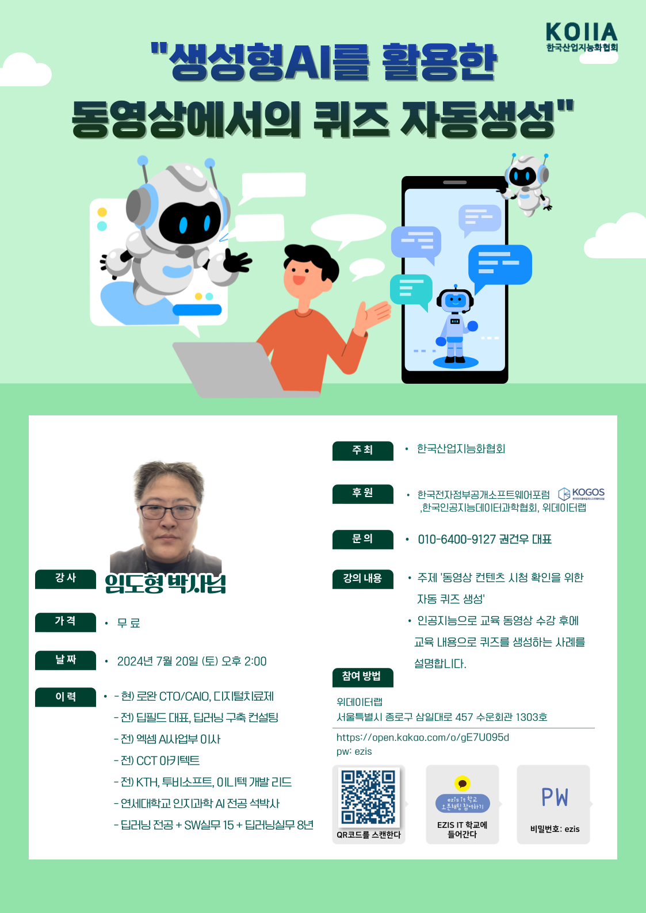

# 한국산업지능화협회 주관 생성형 AI를 활용한 동영상에서의 퀴즈 자동 생성

 

- ChatGPT, OpenAI API 소개 [generative_AI_intro.pptx](generative_AI_intro.pptx)
- OpenAI APi 호출 방법 [openai_api_intro.ipynb](openai_api_intro.ipynb) 

- 동영상 학습 확인을 위한 퀴즈 생성 실습 : [movie_2_quiz.ipynb](movie_2_quiz.ipynb) 
- 동영상에서 음성 네레이션 생성 : [movie_2_voice_narration.ipynb](movie_2_voice_narration.ipynb) 
